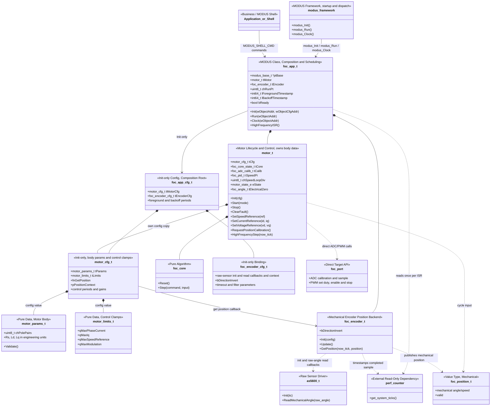
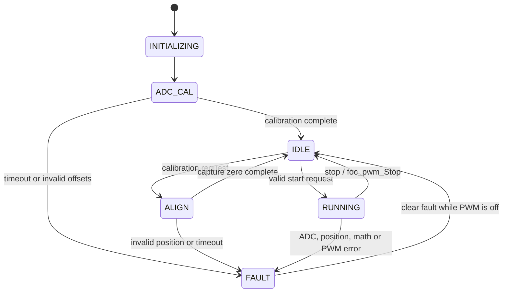

# FOC 极简核心框架重建实施计划（审核稿 v4）

> 本计划尚未确认。Gate A 通过前只允许评审和修改本文档，不实施框架代码。
>
> **v2 修订（评审意见）**
>
> 1. 原 UML 的 `motor_t`/`motor_cfg_t` 只表达生命周期、参考值、限值和位置回调，
>    缺少电机本体参数（电阻、电感、极对数、磁链、额定值）。而第 4 节要求
>    Encoder 在自身内部计算电角度，电角度＝机械角度×极对数，因此 Encoder 必须
>    拿到极对数。v2 补入本体参数结构（见 2.6）。
> 2. `foc_app` 原设计只写成一个“组合与调度对象”，没有 MODUS Class 契约。
>    v2 明确 `foc_app` 必须严格遵循 `class/template_class.h` 与
>    `class/template_class.c` 模板，由 MODUS 启动和调用（见 2.7）。
>
> **v3 修订（第二轮评审意见）**
>
> 3. `motor_limits_t` 语义不清：v2 既没说清“限值是什么”，又让 App 持有了一个
>    没有明确消费点的指针。v3 保留这个类型（评审认为取消限值没有必要），但把
>    语义写清楚——它是**控制钳位（control clamp）**，不是电机铭牌参数——并把
>    它归到 Motor 配置内（`motor_cfg_t.tLimits`），App 不再持有 limits 指针。
> 4. 电机本体参数属于 `motor`：类型定义在 `foc/motor/motor_params.h`，运行期
>    由 `motor_t` 拥有（`motor_t.tCfg.tParams`，配置只有这一份拷贝）。
>    `foc_app` 不再持有 `const motor_params_t *`，也不再有 App 级共享 const
>    实例；Encoder 需要的极对数在 Init 时由组合根从 `motor_cfg_t.tParams` 注入，
>    Encoder 只保存极对数、方向、电气零位三个位置变换字段。

> **v4 修订（本轮收口）**
>
> 5. `motor_params_t` 收敛为本轮确实需要的四个电机参数：极对数、相电阻、
>    D 轴电感和 Q 轴电感；删除磁链、额定电流、额定电速度和 `wValidMask`。
> 6. `motor_limits_t` 只保留为配置声明。本轮不读取、不校验、不调用、不参与
>    Core 或命令处理，后续确认控制策略后再单独启用。

## 1. 目标与边界

从已经删除旧 Motor/App/Encoder 的基线正向重建 FOC 核心。设计遵循 KISS：

- 一个 `motor_t` 表达一台电机的生命周期、控制状态和实时数据；
- `foc_core` 只做无硬件依赖的 FOC 数学；
- ADC/PWM 通过编译期选择的直接 C API 接入，不保留 ops 表；
- 位置只保留控制所需的最小查询和电气零位捕获能力；
- AS5600 只负责 I2C 初始化和原始机械角读取；
- App 只负责对象组合、前台调度和硬件 ISR 入口；
- float/fixed 共用相同的结构、调用流和公开接口；
- 编码器闭环跑通并调优后，再单独设计无感功能。

本轮按单电机、单功率级和编译期选择目标芯片设计，不支持运行时切换
ADC/PWM 实例。未来只有出现明确的多电机硬件需求时，才重新评估 context 或
实例接口，不能提前恢复 ops 表。

### 1.1 代码修改授权边界

本计划只允许修改或创建：

```text
foc/**
peripheral/**
```

以下目录或文件不在本计划的写入授权范围内：

```text
modus/**          第三方库，只允许调用公开 API
target/**
tests/**
class/**
src/**
根目录构建文件
其他设计文档和报告
```

如果实现或自动化验证确实需要修改上述范围，必须先停止并向用户说明原因、
目标文件和最小改动，再取得明确授权。不得预先写入实施任务。

已核对的现有事实（说明本计划不需要任何越界写入）：

- `src/userconfig.h` 已定义 `FOC_APP ((MODUS_ID_MOCK<<8)+2)`，App Class 的
  MODUS 对象 ID 不需要新增或修改；
- `target/stm32g431/stm32g4xx_it.c` 与 `target/at32f413/at32f413_it.c` 已经在
  ADC 中断里调用 `foc_app_HighFrequencyISR()`，SysTick 已经调用
  `modus_Clock()`；`src/main.c` 已经调用 `modus_Init()` 和 `modus_Run()`；
- `Makefile` 在 debug 和 release 两种模式下都定义 `MODUS_ENABLE=1`
  （`Makefile:69/83/103`），因此 App 只有“MODUS Class”一条实现路径，
  不保留 MODUS 关闭时的第二套实现；
- `class/template_class.h` 和 `class/template_class.c` 是 App Class 必须遵循
  的模板；
- 旧 `foc/motor/motor_params.h` 已随旧 Motor 一起删除（`git status` 显示
  `D foc/motor/motor_params.h`），由本计划 Task 3 按 v2 设计重建。

## 2. 核心设计决定

### 2.1 ADC/PWM 使用直接链接接口

当前产品由构建目标选择唯一芯片实现，不需要运行时切换 ADC 或 PWM。因此删除：

```text
foc_adc_ops_t
foc_pwm_ops_t
g_tFocAdcOps
g_tFocPwmOps
ADC/PWM context
```

`foc/hal/foc_port.h` 只声明直接函数，选中的
`peripheral/<chip>/foc_port.c` 提供实现。Host 测试将来若获授权，也通过链接
同名 stub 替换目标实现，不为测试恢复 ops 表。

PWM 只保留三种无重叠语义：

```text
foc_pwm_SetDuty()   写入三相占空比
foc_pwm_Enable()    仅负责使能
foc_pwm_Stop()      从任意状态立即关闭
```

不设计 `Enable(false)` 与 `Stop()` 两条重复关闭路径。

ADC 只保留：

```text
foc_adc_CalibBegin()
foc_adc_CalibStep()
foc_adc_Sample()
```

ADC 采样输出三相电流值，不直接填写完整 `foc_core_input_t`。Motor 负责把三相
电流和位置结果组成本周期 Core 输入，避免硬件端口依赖算法输入结构。

### 2.2 位置边界只保留两个必要动作

Motor 需要：

1. 每个高频周期取得控制用位置；
2. ALIGN 完成时让位置后端捕获电气零位。

因此 `motor_cfg_t` 直接保存两个函数指针和一个共享 context：

```text
fnGetPosition
fnCapturePositionZero
pPositionContext
```

不创建 `motor_position_ops_t`，也不恢复 Init、Reset、Poll 等旧 PositionPort
动作。`motor_GetPosition()` 不是北向公开 API；Motor 在高频步骤内部直接调用
`fnGetPosition`，避免无业务意义的转发层。

### 2.3 Encoder 初始化一次完成

不保留 `RegisterSource()` 再 `Init()` 的两阶段配置。原始角读取函数和 context
直接放入 `foc_encoder_cfg_t`，由 `foc_encoder_Init()` 一次校验并绑定。同一
配置里还包含板级方向 `bDirectionInvert` 以及滤波和超时参数；位置变换需要的
极对数不放进配置结构体，而是作为 Init 形参由组合根从 `motor_cfg_t.tParams`
注入（见 2.6），`foc_encoder_Init()` 校验极对数非零后才接受配置。这样极对数
在配置里只出现一次，Encoder 也不会持有电机参数结构体。

Encoder 只公开：

```text
foc_encoder_Init()
foc_encoder_Update()
foc_encoder_GetPosition()
foc_encoder_CaptureZero()
```

AS5600 初始化由 App/板级组合层执行，不塞入 Encoder 的 source 回调表。

### 2.4 时间基准不扩展第三方库

不修改 `modus/lib/perf_counter`，也不新增 `perfc_get_system_ticks32()`。

App 在 20 kHz ISR 入口只调用一次现有 `get_system_ticks()`，取低 32 位后向下
传递。Encoder Update 在 I2C 成功返回后调用一次相同接口，记录真实的读取完成
时刻。所有年龄计算使用 `uint32_t` 无符号减法处理回绕，系统时钟频率只在
初始化时读取一次。

前台限频和失败退避使用现有 `perfc_is_time_out_us()` /
`perfc_is_time_out_ms()`，它们要求 `int64_t` 时间戳持有者，因此 App 对象的
前台时间戳是 `int64_t`；只有向下传给 Motor 的高频 tick 才是
`get_system_ticks()` 的低 32 位。两种表示不混用。

当前先复用现有接口，不建立第二套 SysTick 溢出计数，也不增加 `foc_time`
包装层。如果实测时间开销使 ISR 无法满足 50 us 截止时间，再提交独立证据并
请求批准目标侧快速计时方案。

### 2.5 App 不是第二层 Motor 门面

`foc_app_t` 是 MODUS 组合和调度对象（Class 契约见 2.7），只拥有 Motor、
Encoder 以及前台调度数据。业务控制直接使用 `motor_Start()`、`motor_Stop()`
和强类型 Reference API；App 不再逐个包装一套同名控制函数。

ISR 入口只保留：

```text
foc_app_HighFrequencyISR()
```

不再增加仅做一次转发的 `foc_app_HighFrequencyStep()`。可独立验证的实时业务
入口是 `motor_HighFrequencyStep()`。

`FOC_MODE_SPEED` 不增加第二个时钟源：Motor 在 20 kHz 高频步骤内用 20 拍
分频执行一次速度 PI，输出只更新内部 `IqRef`，随后仍由同一拍的电流环送入
`foc_core_step()`。因此速度参考不会跨上下文写入，也不需要 Mailbox 或写锁。

### 2.6 电机本体参数归 Motor 所有

缺失的“电机本体”这一层数据补在 `motor` 目录内，并且由 Motor 拥有：

```text
foc/motor/motor_params.h    motor_params_t（本体参数）+ 校验函数
foc/motor/motor.h           motor_limits_t（控制钳位）+ motor_cfg_t + motor_t
motor_cfg_t.tParams         产品配置入口（值，不是指针）
motor_t.tCfg                配置的一份拷贝，本体参数由此拥有
motor_t.tCfg.tParams        本体参数的运行期唯一实例
```

`motor_params_t` 只放本轮需要的纯数据和一个校验函数（纯数据结构不强制对象
API，见编码规则 L1.2）：

```c
typedef struct {
    uint8_t  chPolePairs;                   /* 极对数：机械量→电气量唯一来源 */
    uint32_t wResistanceMilliohm;           /* 定子相电阻 Rs */
    uint32_t wInductanceDMicroHenry;        /* D 轴电感 Ld */
    uint32_t wInductanceQMicroHenry;        /* Q 轴电感 Lq */
} motor_params_t;

foc_result_t motor_params_Validate(const motor_params_t *ptParams);
```

`motor_params_Validate()` 只检查指针非空、极对数非零以及 Rs/Ld/Lq 的工程值
非零；不做额定值、限值或 pu 换算。这样本体参数有明确的最低有效条件，后续
算法仍可在自己的初始化阶段补充更严格的参数要求。

本体参数是**电机的物理数据**（它是什么电机），不是产品施加的约束。两者
不能合成一个结构体，否则“电机是什么”和“产品允许它怎么跑”会混在一起：

| 概念 | 归属 | 例子 |
|---|---|---|
| 本体参数（电机是什么） | `motor_params_t`，`motor_t` 拥有（全系统唯一一份） | 极对数、Rs、Ld、Lq |
| 控制钳位（产品允许它怎么跑） | `motor_cfg_t.tLimits`（`motor_limits_t`） | 见下方 2.6.1 |
| 位置方向（编码器接线） | `foc_encoder_cfg_t.bDirectionInvert` | 板级装配约定 |
| 电气零位 | `motor_t` 运行态（ALIGN 捕获后保存） | ALIGN 捕获 |

单位与数值表示的理由：`FOC_NUMERIC_FIXED` 后端是 Q15 纯标量
（`foc/math/foc_numeric.h`：范围 `[-1, 1)`，分辨率 3.05e-5，物理量按 pu
归一化）。把 mH 级电感或 Ω 级电阻直接写成 `foc_scalar_t` 会损失分辨率
（1 mH 在 Q15 下只有约 33 LSB，量化误差约 3%）。因此本体参数用整数工程
单位保存。Motor Init 必须读取并校验四个字段；极对数由 Motor 在高频环做
机械量到电气量换算，Rs/Ld/Lq 由 Motor 保留给电流环参数初始化使用，
不在 Encoder 或硬件层重复定义。

#### 2.6.1 控制钳位声明（本轮不启用）

`motor_limits_t` 只作为后续控制策略的配置声明。类型定义放在 Motor 内
（`foc/motor/motor.h`，与 `motor_cfg_t` 同文件），并作为
`motor_cfg_t.tLimits` 值成员。本轮实现不得读取、校验、转换或调用这些字段，
也不得让它们影响 Core、PWM 或命令处理：

```c
/* foc/motor/motor.h：控制钳位，属于 Motor 配置，不是电机本体参数 */
typedef struct {
    foc_scalar_t qMaxPhaseCurrent;   /* 后续：相电流参考上限 */
    foc_scalar_t qMaxIq;             /* 后续：Q 轴电流参考上限 */
    foc_scalar_t qMaxSpeedReference; /* 后续：速度参考上限 */
    foc_scalar_t qMaxModulation;     /* 后续：调制比上限 */
} motor_limits_t;
```

- 本轮 `motor_Init()` 不读取、不校验四个字段；允许配置为零；
- App 和 Shell 不得直接改写这些字段，也不得增加转发或校验接口；
- 后续启用限值时，必须另建独立计划，明确单位、消费点和失败语义；
- 本轮不增加母线电压上下限、温度降额或其他限值字段。

#### 2.6.2 归属与消费方

| 数据 | 事实来源 | 谁读取 | 谁写入 |
|---|---|---|---|
| 极对数 | `motor_t.tCfg.tParams.chPolePairs`（全系统唯一事实与内存实例） | Motor Init 校验；Motor 高频电角度换算 | 产品静态配置（经 `motor_cfg_t`） |
| Rs / Ld / Lq | 同上 | Motor Init 校验；电流环参数初始化读取 | 产品静态配置 |
| 控制钳位 | `motor_cfg_t.tLimits`（`motor_limits_t`） | 本轮无消费点 | 产品静态配置 |
| 位置方向 | `foc_encoder_cfg_t.bDirectionInvert` | Encoder 机械位置变换 | 板级静态配置 |
| 电气零位 | `motor_t.tElectricalZero`（ALIGN 捕获） | Motor 高频电角度换算 | Motor ALIGN 完成时写入 |

约束：

- `motor_t.tCfg.tParams` 是本体参数的唯一运行期实例；App 不持有
  `motor_params_t` 指针或副本，也不在 `foc_app_t` 里放任何电机参数成员。
  为避免重复配置，`motor_t` 只保存 `motor_cfg_t` 的一份拷贝，不再另外声明
  `tParams` / `tLimits` 成员。
- `foc_encoder_t` 退化为纯机械位置/速度观测器，只保存机械解环、滤波与方向，
  不保存极对数，不持有电气零位，不保存 Rs/Ld/Lq，不持有 `motor_params_t`
  指针。极对数在全系统（无论静态配置还是运行时 RAM）物理上真正只有一份，
  归 `motor_t` 专有。
- 极对数无需注入 Encoder：`foc_encoder_Init()` 只接收 `foc_encoder_cfg_t`，
  不接收 `chPolePairs`；Encoder 专注输出机械角度与机械速度，电角度换算由
  Motor 在高频环消费机械位置时直接结合自身极对数和电气零位计算。
- `motor_Init()` 必须读取并校验极对数、Rs、Ld、Lq；其中极对数用于 Motor
  的机械量到电气量换算，Rs/Ld/Lq 用于 Motor 的电流环参数初始化。Encoder
  不保存极对数与 Rs/Ld/Lq，也不持有 `motor_params_t` 指针。

### 2.7 foc_app 是标准 MODUS Class

`foc_app` 不是自由函数集合，只遵循 `class/template_class.h` 与
`class/template_class.c` 的必要 Class 契约，由 MODUS 启动和调用；不复制模板
中的示例 RingBuffer、定时器或调试状态：

```text
foc/app/foc_app.h   foc_app_cfg_t、foc_app_t、foc_app_Init/Run/Clock、
                    foc_app_HighFrequencyISR
foc/app/foc_app.c   s_tFocAppBase + s_tFocAppBaseCfg（modus_base_t 及其配置）
                    MODUS_DECLARE_OBJECT(foc_app, FocApp, ...)
```

`foc_app_cfg_t` 只放组合根需要的东西，不单独持有电机本体参数和控制钳位（它们
都属于 `motor_cfg_t`）：`motor_cfg_t tMotorCfg`（内含 `motor_params_t tParams`
和 `motor_limits_t tLimits`）、`foc_encoder_cfg_t
tEncoderCfg`（raw-angle 读回调、方向、滤波与超时）以及前台周期；`foc_app_t`
只有 `ptBase`、`motor_t tMotor`、`foc_encoder_t tEncoder`、PT 游标和时间戳，
没有 `ptMotorParams` / `ptMotorLimits` 这类指针。

与模板的逐项对应：

| 模板元素 | foc_app 对应物 |
|---|---|
| `s_tTemplateClassBase` / `s_tTemplateClassBaseCfg` | `s_tFocAppBase` / `s_tFocAppBaseCfg`，`wId = FOC_APP` |
| `.FcnInterface.Clock` / `.Run` | `foc_app_Clock` / `foc_app_Run` |
| `ptThis->ptBase`、`s_...BaseCfg.wParent = wObjectAddr` | 同名同序，在 Init 第 4 步完成 |
| `MODUS_DECLARE_OBJECT(template_class, TemplateClass, ...)` | `MODUS_DECLARE_OBJECT(foc_app, FocApp, ...)`，唯一实例 `tFocApp` |
| `Init(wObjectAddr, wObjectCfgAddr)` 八步契约 | 同序执行，最后 `mbase_Init()` 并检查返回值 |
| `PERFC_PT_BEGIN(this.chState)` 前台 PT | `PERFC_PT_BEGIN(this.chRunPt)`，只保存 PT 游标和调度时间戳 |
| 显性静态依赖 `pwSharedSystemTick` | 显性配置依赖 `tMotorCfg` / `tEncoderCfg` |

启动与调用规则（全部使用现有框架能力，不新增机制）：

1. `modus_Init()` 遍历 `init_infos` 段自动调用 `foc_app_Init()`；App 不创建
   第二套静态 runtime，也不提供 `foc_app_BackgroundStep()` 这类影子入口。
2. 前台流程在 `foc_app_Run()` 中由对象内的 perfc-PT 游标推进，由
   `modus_Run()` 在主循环每轮调用一次。
3. `foc_app_Clock()` 由 SysTick 1 ms 经 `modus_Clock()` 调用，只做短小周期
   服务和置事件；禁止在 `Clock` 中读 I2C 或推进 PT。
4. `foc_app_HighFrequencyISR()` 不是 MODUS 回调，而是 ADC 中断入口，直接使用
   `MODUS_DECLARE_OBJECT` 生成的 `tFocApp`；硬实时路径按编码规则允许不使用
   PT、日志和阻塞操作。
5. Shell 通过 `MODUS_SHELL_CMD` 注册（`motor start|stop|clear|status|...`），
   处理函数只调用 App/Motor 公开 API，不直接修改对象成员。
6. `FOC_APP` 对象 ID 已存在于 `src/userconfig.h`，`MODUS_ENABLE` 在现有两种
   构建模式下都为 1，因此 App 不保留“MODUS 关闭时的第二套实现”。
7. 模板的 `modus_base_t` 和基础配置是文件级静态对象，只支持单实例；本计划
   本来就是单电机单实例，不设计多实例支持。RingBuffer 是可选依赖，本轮不绑定。

## 3. 最终 UML



`foc_port` 在图中只是直接函数集合，不是对象，不含 ops、context、生命周期或
运行状态。

`motor_params_t` 是纯数据结构，不是对象：类型定义在 `foc/motor/motor_params.h`，
作为 `motor_cfg_t.tParams` 由产品配置一次，`motor_Init()` 校验后随
`motor_cfg_t` 整体复制进 `motor_t.tCfg`。初始化配置是只读的输入模板，运行期
唯一事实来源是 `motor_t.tCfg.tParams`；App 不再声明第二份运行态参数或参数指针。

`motor_limits_t` 是 `motor_cfg_t` 内的值成员，仅作为后续控制钳位声明。本轮
Motor、Core、PWM 和 Shell 都不读取它，也不通过指针共享。

`foc_encoder_t` 退化为纯机械位置/速度观测器，只保存方向和机械解环/滤波状态。
极对数物理上唯一保存在 `motor_t.tCfg.tParams`，电气零位由 `motor_t` 拥有并在
ALIGN 时捕获保存。Encoder 既不持有 `motor_params_t`，也不保存极对数、电气零位
或 Rs/Ld/Lq。电角度由 Motor 在 20 kHz 高频循环中结合自身极对数与电气零位即时换算。

`foc_app_t` 的 `ptBase`、`Run`、`Clock` 和 `MODUS_DECLARE_OBJECT` 生成方式
来自 `class/template_class.{h,c}`，是 App 参与 MODUS 启动和调度的唯一途径。

## 4. 调度与数据流

```text
main 主循环
  modus_Run()
    └─ foc_app_Run(wObjectAddr)            （前台，1 ms 到期条件限频）
        ├─ perfc_is_time_out_us(1000, &this.lForegroundTimestamp)
        └─ foc_encoder_Update(&this.tEncoder)
            ├─ AS5600 raw mechanical-angle read
            └─ sample_tick = low32(get_system_ticks()) 读取成功后记录

SysTick 1 ms
  modus_Clock()
    └─ foc_app_Clock(wObjectAddr)          只做短小周期服务/置事件，
                                           不读 I2C、不推进 PT

ADC ISR，20 kHz
  ADC1_2_IRQHandler()
    └─ foc_app_HighFrequencyISR()
        ├─ now_tick = low32(get_system_ticks())   只读取一次
        └─ motor_HighFrequencyStep(&tFocApp.tMotor, now_tick)
            ├─ foc_adc_Sample()                   三相电流
            ├─ fnGetPosition(context, now_tick)   读机械位置
            ├─ elec_angle = mech_angle * p - zero Motor 内电角度换算
            ├─ foc_core_Step()                    FOC 数学
            └─ foc_pwm_SetDuty()                  三相 CCR
```

Encoder 前台使用两个连续有效机械角及其真实时间差估算机械速度，只发布机械角与
机械速度。20 kHz 高频路径下，`motor_HighFrequencyStep()` 通过回调获取机械
位置快照，再用 Motor 内部持有的唯一极对数 `tCfg.tParams.chPolePairs` 与电气
零位实时换算出电角度与电速度，送入 `foc_core_Step()`。Encoder 彻底不保存
极对数与电气零位，极对数在全系统（配置与运行内存）真正只有唯一一份。组合根
`foc_app_Init()` 不再向 Encoder 注入极对数。高频路径不得读取 I2C、更新速度滤波
或循环等待快照。

前台写、ISR 读采用固定双缓冲和一次索引发布。该机制只解决多字段快照一致性，
不再叠加写锁、Mailbox、sequence 重试或第三份镜像。

## 5. Motor 生命周期



- INITIALIZING、ADC_CAL、IDLE 和 FAULT 必须保持 PWM 关闭；
- ADC_CAL/INITIALIZING 下 Start 直接返回 BUSY，不预约自动起旋；
- ALIGN 使用受限的 D 轴电流，完成后通过 `fnCapturePositionZero` 捕获零位；
- Stop 和所有故障出口首先调用 `foc_pwm_Stop()`；
- 本轮不增加开环启动、Sensor Blend、无感 shadow 或接管状态。
- `motor_Init()` 先校验 `motor_cfg_t.tParams`（`motor_params_Validate()` 通过、
  `chPolePairs`、Rs、Ld、Lq 均有效）；`motor_cfg_t.tLimits` 本轮完全不读取。
  参数校验失败直接返回错误并保持 PWM 关闭，不进入 FAULT，也不进入 ADC_CAL。

### 5.1 App 调度边界

App 不建立第二个业务状态机，也不镜像 Motor 的生命周期或故障状态。`chRunPt`
只保存前台协作游标，前台时间戳和 `bReady` 只用于调度安全门控：

- `bReady == false` 时，前台不读 I2C，高频 ISR 立即返回，PWM 保持关闭；
- 前台按到期条件调用 Encoder Update，失败只更新退避时间，不创建 App ERROR 状态；
- Motor 的 ALIGN、RUNNING、FAULT 和 ClearFault 完全由 Motor 自己管理；
- Encoder 管理样本有效性和超时，Motor 在高频路径消费结果并决定是否故障。

## 6. 硬件不变量

重写接口不等于改动已经台架验证的物理映射：

| 项目 | 必须保持 |
|---|---|
| U 相电流 | ADC1 injected index 0 |
| V 相电流 | ADC2 injected index 1 |
| W 相电流 | ADC2 injected index 0 |
| 电流极性 | STM32G431 保持 `offset - raw` |
| PWM U/V/W | TIM1 CH1/CH2/CH3 |
| PWM 结构 | 三相互补输出与既有死区 |
| ADC 触发 | TIM1 CH4 既有触发配置 |
| AS5600 | 既有 I2C MDI、Init 和 12-bit 原始角读取 |

本计划不得修改 `haladc`、`haltim1`、`hali2c` 或 `port_mdi` 的初始化与通道
配置。若发现接口无法表达现有行为，必须先提交证据并请求批准。

## 7. 实施顺序

### Gate A：设计确认

- [ ] UML 的所有权和调用方向经用户确认；
- [ ] ADC/PWM 直连接口经用户确认；
- [ ] 两动作位置契约经用户确认；
- [ ] `motor_params_t` 仅包含极对数、Rs、Ld、Lq，整数工程单位经用户确认；
- [ ] `motor_params_t` 由 `motor_t` 拥有（`foc/motor/motor_params.h` +
      `motor_cfg_t.tParams` + `motor_t.tCfg.tParams`），且除初始化输入模板外
      没有第二份运行态参数成员经用户确认；
- [ ] `motor_limits_t` 仅声明且本轮不读取、不校验、不调用的约束经用户确认；
- [ ] 极对数物理上唯一存在于 `motor_t.tCfg.tParams`（全系统仅一份，Encoder
      不存极对数）、方向来自板级编码器配置、电气零位由 Motor 管理经用户确认；
- [ ] 底层传感器生命周期由 Encoder 内部通过绑定的 `fnSensorInit/Read`
      驱动，App 对具体传感器（如 AS5600）零感知经用户确认；
- [ ] `foc_app` 遵循 `class/template_class.{h,c}` 的 MODUS Class 契约
      （`ptBase`、`Init/Run/Clock`、`MODUS_DECLARE_OBJECT`、单实例）经用户确认；
- [ ] 第三方和跨目录写入边界经用户确认；
- [ ] Gate A 通过前不修改框架实现。

### Task 0：锁定干净基线

**允许涉及的文件：**

- `foc/foc.h`
- `foc/foc.mk`
- `foc/hal/foc_port.h`
- `peripheral/driver/as5600.h`
- `peripheral/driver/as5600.c`
- `peripheral/stm32g431/foc_port.c`
- `peripheral/at32f413/foc_port.c`

- 保持旧 Motor/App/Encoder、PositionPort 和旧 adapter 已删除；
- 确认 `foc/motor/motor_params.h` 目前不存在（随旧 Motor 删除），由 Task 3
  按 2.6 节重建，Task 0 不提前创建；
- 删除未确认的 `foc_time`/目标 DWT 草稿；
- 确认 AS5600 已收敛为 Init 和原始机械角读取；
- 记录并冻结第 6 节硬件不变量。

### Task 1：建立直接 ADC/PWM 端口

**允许涉及的文件：**

- `foc/hal/foc_port.h`
- `foc/foc_types.h`
- `peripheral/stm32g431/foc_port.c`
- `peripheral/at32f413/foc_port.c`

- 删除 ADC/PWM ops 类型、实例、context 和间接调用；
- 直接函数沿用当前校准、归一化、限幅和三相映射实现；
- ADC 只返回三相电流值，Motor 负责构造 Core 输入；
- PWM 使能和立即停机只有一条各自明确的路径；
- 不拆出新的 ADC/PWM 对象或额外 adapter 文件。

### Task 2：建立 Encoder 位置后端

**允许涉及的文件：**

- `foc/hal/foc_position.h`
- `foc/observer/foc_encoder.h`
- `foc/observer/foc_encoder.c`
- `peripheral/driver/as5600.h`
- `peripheral/driver/as5600.c`
- `peripheral/stm32g431/foc_port_config.h`

- Encoder Init 一次绑定 raw-sensor init/read 回调及 context、方向和滤波/超时
  配置，不接收或校验 `chPolePairs`；
- 底层传感器（如 AS5600）的物理初始化由 Encoder Init 内部调用绑定的
  `fnSensorInit` 回调执行，隔离应用层；
- Update 只在前台读取、记录完成时刻、解环、测速、滤波并发布机械位置；
- GetPosition 只在高频读取机械位置快照、检查年龄、外推机械角度；
- Encoder 退化为纯机械后端，不保存极对数、电气零位、Rs/Ld/Lq，不持有
  `motor_params_t`，也不反向依赖 Motor；
- 极对数在全系统唯一归属 `motor_t`，方向 ← 编码器配置，电气零位 ← Motor ALIGN 捕获。

### Task 3：建立 Motor 对象与电机本体参数

**允许涉及的文件：**

- `foc/motor/motor_params.h`（新建）
- `foc/motor/motor.h`
- `foc/motor/motor.c`

- 新建 `motor_params.h`：`motor_params_t` 和 `motor_params_Validate()`，只放
  极对数、Rs、Ld、Lq 及其校验，不含运行状态、磁链或额定值；
- `motor.h` 声明 `motor_limits_t`（四个控制钳位）、`motor_cfg_t` 和 `motor_t`；
- `motor_cfg_t` 以值成员保存 `motor_params_t tParams` 和
  `motor_limits_t tLimits`，外加机械位置回调和控制配置；不复制 Encoder 或
  硬件对象；
- `motor_t` 只保存 `motor_cfg_t tCfg` 一份拷贝（本体参数因此位于
  `motor_t.tCfg.tParams`），并拥有生命周期、命令/参考、Core、ADC 校准、
  电气零位（ALIGN 捕获后保存于 `motor_t.tElectricalZero`）以及当前周期输入；
  不再另外声明 `tParams` / `tLimits` 成员，避免重复配置；
- `motor_Init()` 校验 `motor_params_Validate()` 通过，失败即返回错误且 PWM
  保持关闭；本轮不读取 `motor_limits_t`；
- `motor_t` 拥有速度 PI 和 20 拍分频计数；`FOC_MODE_SPEED` 下每 20 次高频
  调用执行一次速度 PI，并把输出写入 `IqRef`；
- 高频步骤按 ADC → Position(机械) → 电角度换算(Motor 结合自身极对数与电零位) →
  Core → PWM 的固定顺序执行；
- 控制失败立即停 PWM 并进入 FAULT；
- 不增加 Snapshot、Mailbox、ControlChain 或 RotorSource 对象。

### Task 4：建立 App MODUS Class

**允许涉及的文件：**

- `foc/app/foc_app.h`
- `foc/app/foc_app.c`
- `foc/motor/motor.h`（只读包含）
- `peripheral/stm32g431/foc_port_config.h`
- `peripheral/at32f413/foc_port_config.h`

- `foc_app_cfg_t`、`foc_app_t` 在 `.h` 中完整声明，供 `MODUS_DECLARE_OBJECT`
  实例化；`foc_app_cfg_t` 以值成员包含 `motor_cfg_t` 和 `foc_encoder_cfg_t`；
- `.c` 中按模板建立 `s_tFocAppBase`/`s_tFocAppBaseCfg`（`wId = FOC_APP`，
  `.FcnInterface = { .Clock = foc_app_Clock, .Run = foc_app_Run }`）；本轮不
  绑定 RingBuffer；
- `foc_app_Init()` 按模板八步契约执行：地址校验 → 配置校验 → 对象状态 →
  `ptBase` 与 `wParent` → 配置绑定 → PT/状态/子模块 → MDI 硬件依赖 →
  最后 `mbase_Init()` 并检查返回值；
- App 拥有一个 Motor 和一个 Encoder，Init 顺序为 Encoder（内部驱动底层传感器初始化）
  → Motor；`foc_encoder_Init()` 只传入 Encoder 配置（不传极对数，App 也不依赖
  `as5600.h`）；随后 `motor_Init()` 绑定已就绪的机械位置回调；
- `foc_app_Run()` 只用对象内 PT 游标做 1 ms 到期检查、Encoder Update 和
  100 ms 失败退避，不建立 App 业务状态机；
- `foc_app_Clock()` 只做短小周期服务，不读 I2C、不推进 PT；
- `foc_app_HighFrequencyISR()` 只读取一次时间并调用 `tFocApp.tMotor`；
- Shell 命令用 `MODUS_SHELL_CMD` 注册，只提交 Motor API 命令，不直接改对象
  成员；
- 初始化失败时保持 PWM 关闭并令 `bReady = false`；AT32F413 没有传感器
  绑定时进入 disabled-safe 状态，高频 ISR 立即返回，Motor Start 返回
  `FOC_RESULT_DISABLED`，不伪造开环反馈，也不保留 `BackgroundStep` 或第二套
  静态 runtime。

### Task 5：收口与只读验证

- `foc/foc.h` 和 `foc/foc.mk` 只收录最终实现；
- 搜索确认旧 ops、PositionPort、sensor wrapper 和 adapter 引用为零；
- 搜索确认 `motor_t` 只有一份运行期 `tCfg.tParams`，`foc_app_t` 中没有第二份
  运行态参数或控制钳位成员，Encoder 只持方向和机械滤波解环状态，不含极对数与电气零位；
- 搜索确认 Encoder 中没有 `chPolePairs`、`tElectricalZero` 和 Rs/Ld/Lq 字段；
  极对数全系统仅在 `motor_t.tCfg.tParams` 保留唯一一份；本轮没有任何代码读取或调用
  `motor_limits_t`；
- 清点 `foc_app.c`/`motor.c`/`foc_encoder.c` 的文件静态对象，逐个归入允许
  类别（MODUS base/baseCfg、const 默认参数）；不得新增 RingBuffer；
- 逐项对照 `class/template_class.{h,c}` 检查 App 的 Init/Run/Clock 契约；
- 检查 20 kHz 调用树无 I2C、日志、循环等待和重复取时；
- 使用现有构建入口验证 STM32G431/AT32F413 与 float/fixed 组合；
- 使用现有性能设施测量 ISR 最坏耗时，50 us 内必须留有明确余量；
- 真机确认 ADC 零偏、电流极性、编码器方向、电气零位、相序和 PWM 安全行为。

自动化测试代码当前不在写入授权范围内。若需要恢复或新建测试入口，在 Task 1
实施前单独申请授权；未获授权不代表可以跳过验证证据。

## 8. Gate B：框架冻结条件

- [ ] 源码中不存在 ADC/PWM ops 和旧 PositionPort；
- [ ] 20 kHz 主链只有 App ISR → Motor → ADC/Position/Core/PWM；
- [ ] 高频路径无 I2C、日志、锁、重试循环和重复时间读取；
- [ ] `motor_t` 没有重复配置、重复快照或无归属成员；
- [ ] `motor_t` 只有一份运行期 `tCfg.tParams`，`foc_app_t` 中没有第二份运行态
      参数或控制钳位成员，Encoder 退化为纯机械后端且不含极对数与电气零位；
- [ ] 20 kHz 主链中电角度由 Motor 自主换算，App 与具体传感器驱动（如 AS5600）彻底解耦；
- [ ] `motor_limits_t` 只在 Motor 配置内声明，源码中没有读取或调用；
- [ ] `motor_params_Validate()` 在 Init 失败时 PWM 保持关闭；
- [ ] App 的 Init/Run/Clock 与 `class/template_class.{h,c}` 契约逐项对齐，
      Shell 只通过公开 API 提交命令，不存在第二套静态 runtime；
- [ ] App 不建立与 Motor 重复的业务状态机；
- [ ] float/fixed 结构和调用关系一致；
- [ ] STM32G431/AT32F413 构建结果不存在目标对象交叉复用；
- [ ] 真机行为保持已验证 ADC/PWM/编码器方向和安全语义；
- [ ] ISR 最坏耗时满足 50 us 截止时间并保留后续观测器预算；
- [ ] Gate B 报告交用户审核。

Gate B 通过后，再为 V/F、I/F、SMO、HFI、Sensor Blend 和无感接管建立独立
功能计划；这些属于框架上的业务功能，不进入本轮核心重建。
