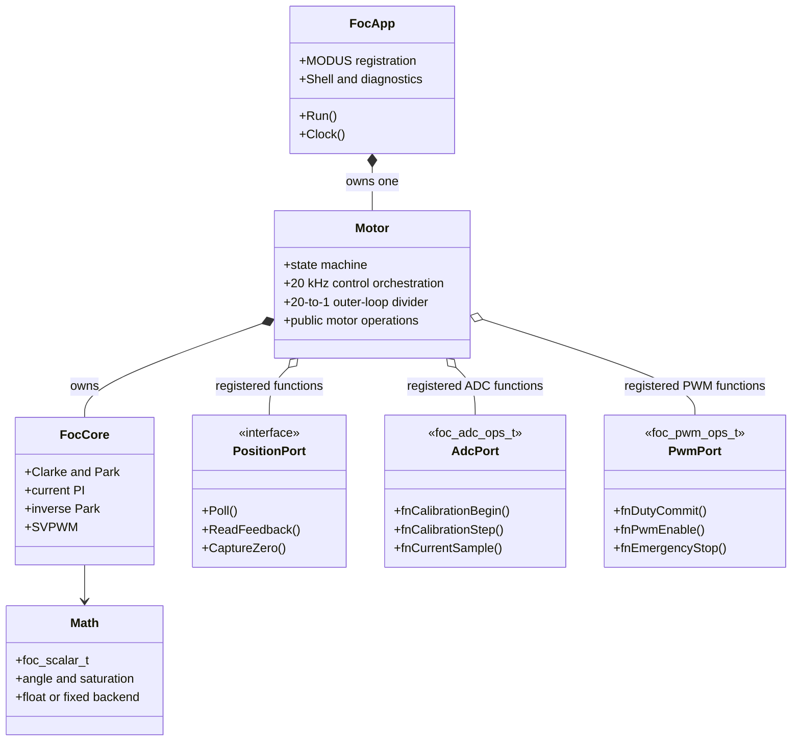
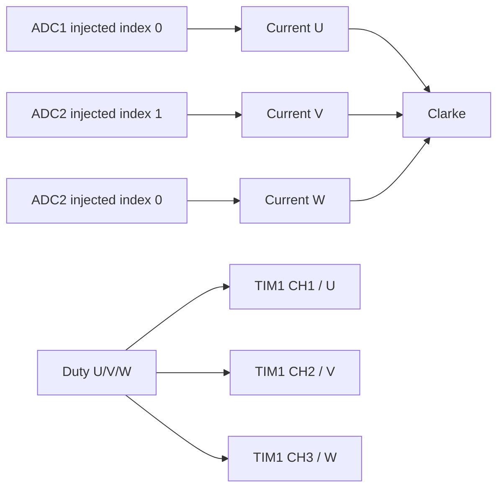
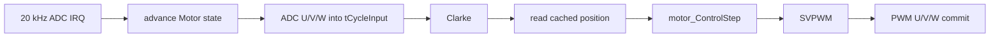
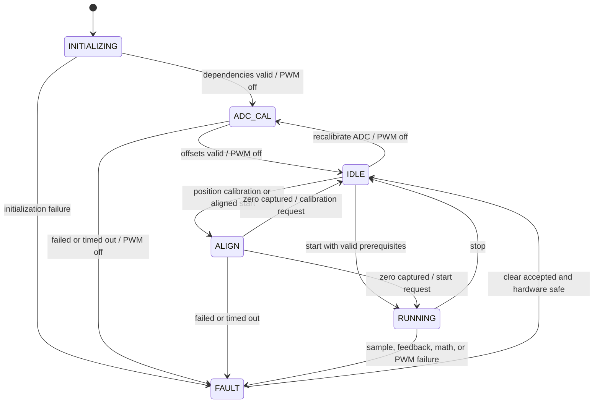

# FOC Framework Design

> Status: Draft for review. This document defines the framework boundary only;
> no C implementation starts until it is approved.

## 1. Objective

Build a small FOC framework with one Motor object, the two existing ADC/PWM
hardware contracts, one position-feedback boundary, and one deterministic
control path. The existing float/fixed numeric backends and verified STM32G431
phase mapping must remain unchanged.

The framework is complete when the existing encoder current/speed loop can run
through it. Encoder tuning is the first feature after framework closeout;
sensorless algorithms follow later.

## 2. Non-goals

The framework does not implement or enumerate SguanFOC's nineteen named modes.
It does not implement SMO, NLFO, HFI, observer fusion, shadow comparison, or
runtime mode switching. Those are later features built on the framework.

There is no dynamic registry, algorithm graph, generic manager, heap allocation,
lock-free BUSY/retry protocol, duplicated App API, or duplicated status object.

## 3. Three-layer architecture



Only three layers exist:

1. `foc_app`: MODUS and product glue.
2. `motor`: lifecycle, scheduling, safety, and control orchestration.
3. Hardware-independent algorithms plus registered hardware/position functions.

There is no dependency from Motor, FocCore, or a hardware adapter back to
`foc_app_t`.

## 4. Responsibilities

### 4.1 FocApp

`foc_app_t` owns one `motor_t` and only App-specific state such as its MODUS base,
PT cursor, shell parsing, and diagnostics configuration.

FocApp does not own a second position object, startup state, control command,
fault set, or status structure. Shell handlers call `motor_xxx()` directly on the
owned Motor. Public `foc_app_Start()`, `foc_app_Stop()`, reference setters, and
`foc_app_GetStatus()` mirrors are removed.

### 4.2 Motor

`motor_t` is the only owner of:

- lifecycle and faults;
- ADC calibration and encoder alignment workflow;
- active control mode and reference;
- FOC Core and speed PI runtime state;
- the persistent current-cycle input object consumed by FocCore;
- current position feedback;
- registered ADC, PWM, and position functions.

Motor does not own product shell, waveform formatting, MODUS registration, or
concrete chip drivers.

### 4.3 FocCore

FocCore is deterministic and hardware-independent. It receives current, angle,
and a control reference, then runs the selected voltage/current calculation and
SVPWM. It does not know whether the angle came from open loop, an encoder, Hall,
or a future observer.

## 5. Frozen hardware and phase contract

The current STM32G431 ADC/PWM implementation is already bench adapted. Framework
work may change its caller but must not change these mappings:



| Contract | Frozen behavior |
|---|---|
| U current | `haladc_GetInjected(HALADC_ADC1, 0U)` |
| V current | `haladc_GetInjected(HALADC_ADC2, 1U)` |
| W current | `haladc_GetInjected(HALADC_ADC2, 0U)` |
| current polarity | `offset - raw` on U, V, and W |
| Clarke convention | `alpha = U`, `beta = (V - W) / sqrt(3)` |
| PWM mapping | U → CH1, V → CH2, W → CH3 |
| ADC trigger | existing TIM1 CH4 trigger |
| direction | existing encoder direction plus U/V/W order |
| electrical zero | existing zero capture and pole-pair conversion |

The ADC/PWM sections of `peripheral/stm32g431/foc_port.c`, `haladc.c`, and
`port_mdi.c` are not cleanup targets. Removing an obsolete sensor wrapper must
not alter the mapping expressions above.

## 6. Control modes without a mode framework

Motor needs only four control modes:

```text
VOLTAGE
CURRENT
SPEED
POSITION
```

The high-frequency path calls one internal control entry:

```text
motor_ControlStep(motor, controlMode)
```

It is a small switch, not one function or object per named mode.

SguanFOC's modes remain possible through ordinary feature composition:

- V/F open loop = virtual angle + VOLTAGE, with a V/F reference generator.
- I/F open loop = virtual angle + CURRENT, with an I/F reference generator.
- encoder voltage/current/speed/position = encoder feedback + the corresponding
  control mode.
- Hall or sensorless operation = a later feedback implementation + SPEED.
- HFI/SMO/NLFO fusion = a later sensorless coordinator that outputs the same
  angle/speed value.
- debug modes = encoder remains the control feedback while an observer runs only
  in diagnostics.

The framework therefore accommodates the ideas in
[SguanFOC](https://github.com/Sguan-ZhouQing/SguanFOC_Library) without copying its
nineteen-mode enumeration or compile-time condition matrix into Motor.

## 7. Position feedback and future observers

Physical position feedback and sensorless observation have different inputs and
different timing. They share only their output value, not one oversized ops table.

### 7.1 Current position interface

The encoder/open-loop position interface contains only operations required now:

```text
Init(context, motor parameters)
Reset(context)
Poll(context)                         // foreground-only hardware update
ReadFeedback(context, feedback)       // fast cached read; no I2C/SPI
CaptureZero(context)                  // optional encoder capability
```

`ReadFeedback()` returns electrical angle, electrical speed, validity, and
optional mechanical feedback. It never performs blocking hardware access.
`Poll()` may perform a blocking I2C/SPI transaction and therefore may be called
only from `foc_app_Run()` through `motor_BackgroundStep()`. It must never run in
the 1 ms Clock interrupt or the 20 kHz control interrupt. The provider uses a
monotonic timestamp to limit the transaction rate to 1 kHz and to apply failure
backoff; the Clock interrupt supplies time only and never performs the transfer.

### 7.2 Future observer interface

A future observer is an independent algorithm contract:

```text
Init(context, motor parameters, sample period)
Reset(context)
Step(context, currentAB, appliedVoltageAB, busVoltage, outputFeedback)
```

It returns the same position-feedback value as the encoder, but its algorithm
input does not burden the physical encoder API. HFI voltage injection and
observer-fusion state belong to their later feature modules.

## 8. External Motor API

Framework scheduling:

```text
motor_Init()
motor_HighFrequencyStep()             // PWM/ADC 20 kHz context
motor_BackgroundStep()                // foc_app_Run() foreground only
```

Business operations:

```text
motor_Start(motor, controlMode)
motor_Stop()
motor_SetVoltageReference(motor, dVoltage, qVoltage)
motor_SetCurrentReference(motor, dCurrent, qCurrent)
motor_SetSpeedReference(motor, electricalSpeed)
motor_SetPositionReference(motor, electricalPosition)
motor_RequestAdcCalibration()
motor_RequestPositionCalibration()
motor_ClearFault()
motor_GetStatus()
```

The API exposes user intent. It does not expose `SubmitCommand()`, a mailbox, or
provider selection. Reference setters are deliberately mode-specific: this
keeps each C signature strongly typed and avoids a discriminated union that every
caller would have to initialize. `motor_Start()` selects the already configured
control mode; Motor validates that mode's reference and prerequisites before
enabling PWM. While IDLE, any setter may preload its own reference fields. While
RUNNING, only the setter matching the active mode is accepted. A setter never
changes the selected mode.

The speed-loop Iq limit is a Motor configuration/safety constraint, not part of
the speed reference. It is configured independently and clamps every speed-PI
result. A runtime Iq-limit setter is added only if product requirements later
need dynamic torque limiting; it is not hidden inside `motor_SetSpeedReference()`.

Each setter performs its explicit field assignments inside one private, short
interrupt critical-section primitive. The setter has one saved interrupt state
and one restore exit; reference validation does not scatter repeated resume calls
across branches. The primitive only protects the copy and does not become a
generic union-based reference writer. It does not run an algorithm, wait for
hardware, return BUSY, or require retries. `Stop()` always performs
`EmergencyStop()` immediately before software-state convergence.

`motor_GetStatus()` performs one short coherent copy. There is no published
snapshot buffer and no second `foc_status_t` in FocApp.

## 9. Timing and data flow

### 9.1 High-frequency path



The registered ADC and PWM functions are retained because hardware-function
registration and host-test injection are project requirements. There are only
the necessary calls: current sample, cached position read, duty commit, and
enable/emergency operations on state transitions. Their real cost is measured;
the framework does not add more high-frequency virtual layers.

### 9.2 Speed-loop scheduling

The speed PI runs inside `motor_HighFrequencyStep()` once every twenty calls. In
SPEED mode the divided step performs:

```text
speed error -> speed PI -> clamp -> Iq_ref
```

PI parameters (`Kp`, `KiTs`, and limits) do not change. Only the PI runtime state
(`qIntegrator` and `qPreviousError`) and resulting `Iq_ref` change. Because the
same 20 kHz context owns both outer- and inner-loop state, there is no Iq mailbox,
write lock, SysTick phase jitter, or second control writer.

At the current user-measured 35 us high-frequency baseline, the deadline is 50 us
or 8500 cycles. A historical profile measured both D/Q current PI operations at
about 844 cycles; using roughly half as a conservative first estimate for one
speed PI gives approximately 422 cycles or 2.5 us. The divided worst tick is
therefore estimated at 37.5 us, while average cost is only about 21 cycles per
high-frequency tick.

This estimate authorizes design, not acceptance. After implementation, DWT must
measure the maximum tick with the divider enabled. The change is accepted only at
no more than 6800/8500 cycles (80%) with zero deadline overruns. If it fails that
gate, optimize the existing 20 kHz path before adding an observer; do not move
Motor control into the App Clock.

The independent 1 ms App Clock remains available only for MODUS timekeeping and
lightweight event posting; it performs no I2C/SPI access and runs no Motor
control loop. Cached encoder hardware polling belongs exclusively to
`motor_BackgroundStep()` called by `foc_app_Run()`. POSITION mode may later use
another divider in the same high-frequency owner.

## 10. Safety state machine

ADC zero-current calibration and powered rotor alignment remain separate because
their power-stage invariants are opposite.



State invariants:

- `INITIALIZING`, `ADC_CAL`, `IDLE`, and `FAULT`: PWM disabled.
- `ALIGN`: PWM enabled with the existing fixed D-axis alignment current and
  existing 1.5-second duration.
- `RUNNING`: normal mode control and PWM enabled.
- Every fatal transition calls `EmergencyStop()` before entering `FAULT`.
- Every waiting state has a `perf_counter` timeout and an error path.

A future sensorless startup/fusion state machine belongs to that feature module;
it does not replace these power-stage safety states.

## 11. Diagnostics without Motor pollution

The debug-only `qIuLatest`, `qIvLatest`, and `qIwLatest` mirror members are
removed from `motor_t`. Instead, `motor_t` owns one persistent
`foc_core_input_t tCycleInput` member for its entire lifetime. Each 20 kHz cycle
updates that member in place and passes its address to FocCore. It must not be a
stack local, and the containing Motor object must not be copied or relocated
after waveform registration.

If phase current must remain addressable for waveform capture, mwaveform binds
directly to `&ptMotor->tCycleInput.qIu`, `.qIv`, and `.qIw`. Those addresses
remain valid for the Motor object's lifetime. `tCycleInput` is real production
input state, not a waveform-only mirror. `mwaveform.Step()` samples it after
`motor_HighFrequencyStep()` in the same interrupt, so the three phase values are
from the completed control cycle rather than a partially updated foreground
view. Other waveform channels bind to existing FocCore/Motor state or are
unavailable until a real control value exists.

## 12. Reduction list

| Remove or simplify | Result |
|---|---|
| App-owned `foc_sensor_t` plus Motor position adapter | one position boundary |
| App-owned startup/position state | Motor is the only domain owner |
| mirrored `foc_app_xxx()` control API | Shell/product code calls Motor directly |
| `foc_status_t` plus `motor_status_t` | only `motor_status_t` |
| `Observe()` plus `Read()` encoder contract | cached `ReadFeedback()` only |
| observer input fields in encoder ops | observers get a separate future API |
| nineteen-mode framework table | four control modes; features compose around them |
| lock-free command mailbox and BUSY retries | one bounded critical section per operation |
| generic union-based `motor_SetReference()` | explicit strongly typed reference setters |
| Iq cross-context handoff | speed divider updates `Iq_ref` in the 20 kHz owner |
| generic `CALIBRATING` plus job subtype | explicit `ADC_CAL` and `ALIGN` states |
| waveform-only Motor mirror fields | observe real control-cycle data |
| mutable file-static algorithm pools | all runtime state belongs to objects |

## 13. File responsibilities

| File | Responsibility |
|---|---|
| `foc/app/foc_app.c/.h` | MODUS glue, Shell, scheduling, diagnostics |
| `foc/motor/motor.c/.h` | Motor object, API, state machine, 20 kHz orchestration and divider |
| `foc/motor/motor_position.h` | current cached position-feedback contract |
| `foc/middleware/foc_core.c/.h` | pure FOC transforms, control, and modulation |
| `foc/hal/foc_port.h` | separate `foc_adc_ops_t` and `foc_pwm_ops_t` contracts |
| `foc/math/*` | float/fixed primitives and angle/trig math |
| `peripheral/stm32g431/foc_port.c` | frozen board mapping through MDI |

No new manager, registry, profile object, transition graph object, or generic
algorithm container is introduced.

## 14. Verification gates

Framework closeout requires:

- float and fixed host tests pass;
- two Motor instances prove there is no mutable static algorithm state;
- ADC U/V/W, current polarity, TIM1 CH4 trigger, and PWM U/V/W mappings remain
  unchanged;
- state tests prove ADC_CAL can never enable PWM;
- state tests prove ALIGN enables PWM only with the bounded D-axis request and
  always exits on completion, stop, fault, or timeout;
- App contains no duplicate position/control/status state and no mirrored public
  control API;
- every mwaveform variable address points to an object-lifetime Motor/FocCore
  member; no stack address is registered;
- `foc_app_Clock()` performs no sensor transaction and does not call
  `motor_BackgroundStep()`; `foc_app_Run()` is the sole owner of foreground
  position `Poll()` scheduling, with timestamp-based 1 kHz rate limiting;
- voltage, current, speed, and position setters update only their matching
  strongly typed reference fields and never change mode;
- command/reference critical sections are centralized and contain only bounded
  copies, with no algorithm or hardware wait inside;
- the existing separate `foc_adc_ops_t` and `foc_pwm_ops_t` interfaces and their
  board adapters remain separate;
- `motor_HighFrequencyStep()` is the only speed-PI, current-PI, `Iq_ref`, and
  PWM-command writer; PI parameters remain unchanged at runtime;
- debug-rel and release target builds pass;
- the divided speed-loop worst tick is at most 6800/8500 cycles with zero
  overruns before adding an observer.

## 15. Delivery order

After this design is approved, the code plan will enforce this order:

1. Freeze phase mapping and existing hardware behavior with tests/checks.
2. Reduce FocApp to MODUS/product glue and remove duplicated state/API.
3. Simplify the current encoder position contract while preserving foreground
   polling in `foc_app_Run()` and the 20 kHz cached-read behavior.
4. Restore explicit ADC_CAL and ALIGN safety states.
5. Centralize short request/status critical sections and remove distributed
   interrupt guards.
6. Move the speed PI to a 20-to-1 high-frequency divider and remove the Iq
   cross-context handoff.
7. Move the real current-cycle input into persistent Motor storage, bind
   mwaveform to it, and remove waveform mirrors and other dead interfaces.
8. Run the complete host/target verification matrix and measure 20 kHz timing.
9. Run the encoder path end to end: ADC calibration, alignment/zero, direction,
   current loop, then speed loop.
10. Tune the encoder speed loop and record the new bench baseline.
11. Only then create a separate sensorless feature design and algorithm-migration
    plan.
